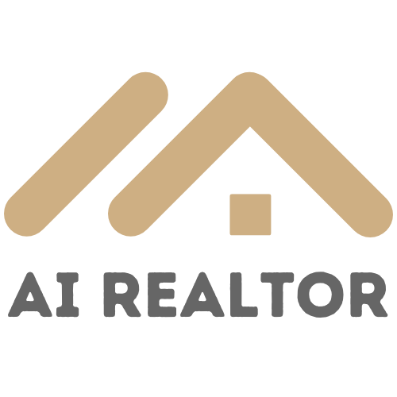

# Multi-Agent AI Realtor

<div align="center">
  <table>
    <tr>
      <td>
        
      </td>
      <td>
        <div>
          
          
          <br><br>
          
          
          
          
          <br><br>
          
          
          
          
          
        </div>
      </td>
    </tr>
  </table>
</div>

A multi-agent real estate AI assistant built using **LangChain**, **LangGraph**, **LangSmith** for observability, and **LangMem** for persistence. Powered by OpenAI's **GPT-5**, the system includes a **Property Finder agent** that parses natural language requests and queries a **Supabase** backend via RPC, and **Calendar Manager agent** responsible for scheduling viewings. Search results are displayed using **Generative UI** in a clean, in-chat interface built with **React** and **Tailwind CSS**.

## Features

- 🏠 **Natural Language Property Search**: Ask for properties in plain English
- 📅 **Smart Calendar Management**: Schedule property viewings with intelligent calendar coordination
- 🎨 **Modern React UI**: Beautiful property carousels with responsive design
- 🤖 **Clean LangGraph Architecture**: Supervisor pattern with specialized sub-agents
- 💾 **Long-Term Memory**: Remembers user preferences and information across conversation threads
- 🗄️ **Supabase Integration**: Real-time property data from PostgreSQL database
- 🧪 **Comprehensive Testing**: 86 tests (70 unit + 16 integration) with full LangGraph tool coverage

## Prerequisites

Before running this project, make sure you have:

- **Python 3.10+** installed
- **Node.js 18+** and **npm** installed
- **OpenAI API Key** ([Get one here](https://platform.openai.com/api-keys))
- **Supabase Project** ([Create one here](https://supabase.com))
- **LangSmith Account** (Optional, for tracing - [Sign up here](https://smith.langchain.com))

## Quick Start

1. **Clone the repository:**
   ```bash
   git clone https://github.com/yourusername/multi-agent-ai-realtor.git
   cd multi-agent-ai-realtor
   ```

2. **Install Python dependencies with uv (no pip):**
   ```bash
   # One-time (install uv)
   curl -LsSf https://astral.sh/uv/install.sh | sh

   # Install the project and dependencies (creates .venv automatically)
   uv sync
   ```

3. **Install frontend dependencies:**
   ```bash
   cd src/frontend
   npm install
   ```

4. **Build the frontend CSS:**
   ```bash
   npm run dev
   ```

5. **Configure Environment Variables**

Copy `.env.example` to `.env` and fill in your actual API keys:

```bash
cp .env.example .env
```

Required variables:
- `OPENAI_API_KEY`: Your OpenAI API key
- `SUPABASE_URL`: Your Supabase project URL  
- `SUPABASE_KEY`: Your Supabase anon key
- `LANGSMITH_API_KEY`: Your LangSmith API key (optional, for tracing)

6. **Run the application:**
   ```bash
   # From the project root directory
   uv run langgraph dev
   ```

7. **Access the UI:**
   Open [Agent Chat](https://agentchat.vercel.app/?apiUrl=http://localhost:2024&assistantId=agent) in your browser to interact with the AI agents and see the rendered property carousel UI.
   
   **Note:** The property carousel and other UI components will only render in Agent Chat, not in the LangGraph Studio interface.

## Usage Examples

Try these natural language queries in the chat interface:

- "Show me 2-bedroom apartments in New Cairo under 5M EGP"
- "Find villas with swimming pools in 6th of October City"
- "I need a 3-bedroom apartment with parking in Maadi"
- "Show me properties under 3 million EGP with gardens"

## Project Structure

```
multi-agent-ai-realtor/
├── src/
│   ├── agents/                   # LangGraph agent implementations
│   │   ├── supervisor/          # Supervisor agent and state management
│   │   ├── property_finder/     # Property search specialist
│   │   └── calendar_manager/    # Calendar and scheduling specialist
│   ├── frontend/                # React UI components (Tailwind CSS)
│   ├── utils/                   # Shared utilities (Supabase, Google Calendar)
│   └── graph.py                 # Main application entry point
├── tests/                       # Comprehensive unit test suite
│   ├── conftest.py             # Global test configuration
│   └── unit/                   # Unit tests for LangGraph tools
├── langgraph.json               # LangGraph configuration
├── pyproject.toml               # Python dependencies
└── .env                         # Environment variables
```

## Development

### Architecture Overview

The application follows a **clean supervisor-agent pattern** with modular, specialized components:

#### **Core Components:**
- **Supervisor Agent** (`src/agents/supervisor/`): Orchestrates conversation flow, manages user memory, and coordinates UI rendering
- **Property Finder** (`src/agents/property_finder/`): Specialized agent for natural language property search and filtering
- **Calendar Manager** (`src/agents/calendar_manager/`): Handles scheduling, availability checking, and appointment booking
- **React UI Components** (`src/frontend/`): Modern, responsive property carousel with Tailwind CSS
- **Database Integration** (`src/utils/`): Supabase PostgreSQL with property data and RPC functions

#### **Key Design Principles:**
- **🏗️ Modular Architecture**: Each agent is self-contained with its own tools and responsibilities
- **🎯 Separation of Concerns**: Agents focus on domain expertise, supervisor handles orchestration
- **🎨 Centralized UI**: All UI rendering happens at supervisor level using `render_property_carousel`
- **⚡ Stateless Tools**: Tools use Command pattern for clean, predictable state updates
- **🔒 Type Safety**: Full TypeScript/Python type annotations throughout the codebase
- **📦 Clean Imports**: Proper module organization with clear dependency paths

#### **Agent Workflow:**
1. **User Input** → Supervisor analyzes intent and delegates to appropriate agent
2. **Property Search** → Property Finder parses query and searches database
3. **UI Rendering** → Supervisor uses `render_property_carousel` to display results
4. **Appointment Booking** → Calendar Manager handles scheduling when requested

## Testing

The project includes comprehensive testing for all LangGraph tools with **86 tests total** - **ALL PASSING** ✅:

### **Unit Tests (70 tests):**
- ✅ **parse_property_search_query** (12 tests): Natural language parsing with LLM mocking
- ✅ **search_properties** (16 tests): Database queries with Supabase RPC mocking
- ✅ **find_available_slots** (14 tests): Google Calendar API integration with timezone handling
- ✅ **schedule_viewing** (14 tests): Event creation with input validation and error handling
- ✅ **render_property_carousel** (14 tests): UI rendering with state injection testing

### **Integration Tests (16 tests):**
- ✅ **Property Search Flow** (5 tests): End-to-end query parsing → property search workflow
- ✅ **Calendar Flow** (5 tests): Complete slot finding → viewing scheduling workflow
- ✅ **Render Carousel** (6 tests): Property carousel rendering with realistic application state

### **Testing Infrastructure:**
- **LangChain Standard Tests**: Schema validation, tool initialization, and metadata verification
- **Custom Unit Tests**: Business logic, error handling, API integration, and edge cases
- **Integration Tests**: End-to-end workflows testing realistic tool interactions
- **Global Mocking**: Supabase client, Google Calendar API, and LLM calls properly mocked
- **Direct Function Testing**: Innovative approach for testing tools with `InjectedState` parameters

### **Run Tests:**
```bash
# Run all tests (unit + integration)
uv run pytest tests/ -v

# Run only unit tests
uv run pytest tests/unit/ -v

# Run only integration tests
uv run pytest tests/integration/ -v

# Run tests for a specific tool
uv run pytest tests/unit/test_search_properties.py -v

# Run tests with coverage report
uv run pytest tests/unit/ --cov=src --cov-report=term-missing
```

### **Test Structure:**
```
tests/
├── conftest.py              # Global test configuration and mocking
├── unit/                    # Unit tests for individual tools
└── integration/             # Integration tests for end-to-end workflows
```

## Contributing

1. Fork the repository
2. Create a feature branch
3. Make your changes
4. **Add/update tests** for any new functionality
5. **Run the test suite**: `pytest tests/ -v` (both unit and integration tests)
6. Ensure all tests pass
7. Submit a pull request

### **Testing Guidelines:**
- All new LangGraph tools must include comprehensive unit tests
- Add integration tests for new workflows or tool interactions
- Follow the established testing patterns (LangChain Standard Tests + Custom Tests)
- Mock external dependencies (Supabase, Google Calendar, LLM calls)
- Test error handling, edge cases, and input validation
- Maintain the current test coverage standards (86+ tests)

📖 **For detailed testing documentation, examples, and guidelines, see [tests/README.md](tests/README.md)**

## License

MIT
